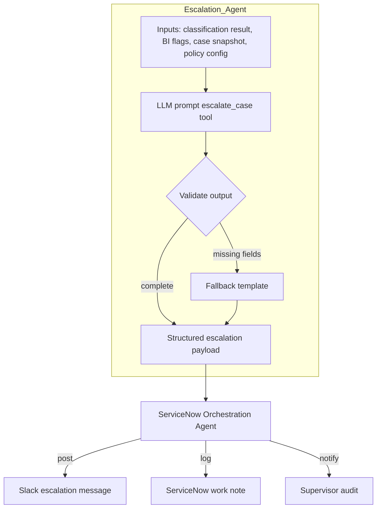
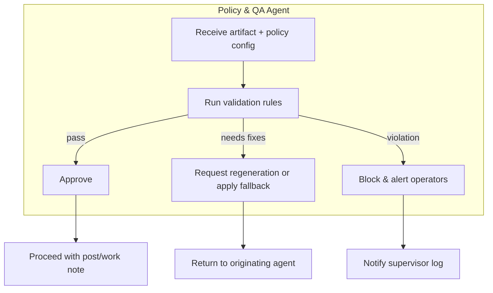
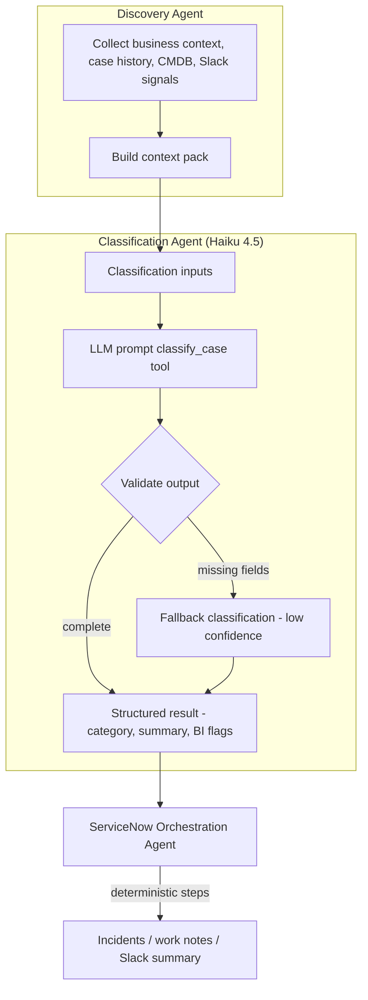
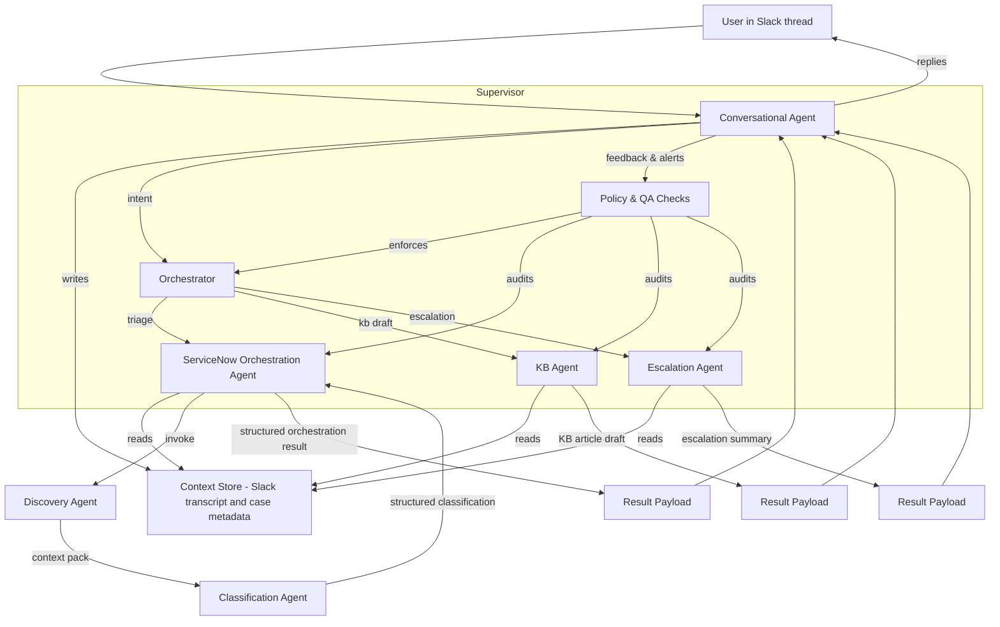

## Agent Architecture Overview

- **Conversational Agent**  
  Maintains the active Slack thread context, writes structured updates to the shared store, and handles everyday guidance. Escalates only when a user explicitly requests automation (e.g., “triage this case”) or when policy rules demand it.

- **Shared Context Store**  
  Existing context manager plus ServiceNow snapshots. Serves as the single source of truth for transcripts, case metadata, and recent journal extracts.
  - **Open Question:** What retention, tenant-isolation, and RBAC/PII-redaction policies govern this store so concurrent specialists don’t clobber each other’s state and compliance knows how long ServiceNow-derived data persists?

- **Orchestrator**  
  Inspects intent and routes work to the appropriate specialist agent (triage, KB drafting, escalation, etc.), enforcing prerequisites (valid case number, permissions) before dispatch.

- **Specialist Agents**  
  Stateless, single-purpose workers (Discovery, ServiceNow orchestration, KB drafting, escalation messaging today; future workflows later). Each pulls what it needs from the context store, produces structured output, and hands results back for user-facing delivery.
  - **Connectivity Reasoning Agent**  
    Consumes the Discovery `context_pack`, calls approved REST controllers (e.g., Palo Alto Strata Cloud Manager, FortiManager, VeloCloud) for live routing/tunnel status, runs lightweight heuristics to explain connectivity gaps, and returns proposed diagnostics or follow-up questions. Results flow back through the orchestrator to the conversational agent so humans receive actionable next steps. Operates in read-only mode; effectiveness depends on the availability of those controller APIs.

    - **Open Question:** What authentication, rate-limit, timeout, and fallback strategy keeps this agent from stalling the orchestrator when controller APIs are degraded or unavailable?

- **Supervisor**  
  Policy/QA layer that governs the orchestrator and specialists. Ensures guardrails (required sections, policy compliance, duplication control), audits results, and raises alerts back to the conversational agent or operators.

  - **Open Question:** Can the supervisor patch escalation payloads (per this section) or are escalations immutable until a human replay (per the HITL workflow)? We need one rule so audits match behavior.

## Implementation Strategy (Incremental Rollout)

To reach the target architecture without destabilizing the current production workflow, we layer capabilities behind feature flags and thin orchestration adapters. Each new capability should plug into the existing `context → prompt → agent → formatter` loop instead of replacing it outright.

1. **Stabilize Core Loop**
   - Keep `lib/agent/orchestrator.ts` as the single entry point.
   - Extend the context loader with new metadata (`discovery`, `spm`, `policySignals`) but leave the outer flow unchanged until each signal proves reliable.

2. **Shadow Services Behind Flags**
   - **Discovery Pack:** Build `discoveryRunner.generateContextPack()` that deterministically aggregates business context, recent Slack traffic, CMDB hits, similar cases, and (optionally) SPM project summaries. Start by logging/attaching metadata, then inject into prompts once validated.
     - **Status:** Schema v1.0.0 is documented in `docs/DISCOVERY_CONTEXT_PACK_SCHEMA.md` (fields, ordering, size budgets, versioning).
   - **Supervisor:** Add a policy validator that inspects outbound Slack/work-note payloads and logs warnings. When confidence is high, flip the flag to enforce blocking behavior.
   - **SPM Consumers:** Surface SPM data as optional sections (“experimental project summary”) before making it part of the canonical response.

3. **Adapter-First Design**
   - Introduce thin facades named after architectural components (e.g., `discoveryService`, `policySupervisor`, `spmContextLoader`). Internal implementations can evolve without forcing cascading changes across callers.

4. **Leverage Existing Deterministic Modules**
   - Reuse the business-context service, search facade, context manager, and new SPM repositories to assemble the `context_pack`. Avoid large monolith rewrites; compose smaller services.

5. **Passive Flow Caution**
   - Route new passive behaviors through the existing `lib/passive/actions` and KB state machine so debouncing and throttling continue to work. Test for regressions such as “passive mention” before enabling globally.

6. **Release Process**
   - Ship each capability under a dedicated feature flag, exercise it on a small set of channels/customers, then promote to GA.
   - Maintain snapshot tests/integration tests comparing legacy vs new outputs to detect regressions quickly.

## Parallel Workstreams

Multiple teams can progress simultaneously because the architecture layers are loosely coupled:

1. **ServiceNow SPM Enablement**
   - Complete Phase 1 plumbing (repository implementation, factory wiring, `lib/tools/servicenow.ts` helpers) for `pm_project`, `pm_epic`, and `rm_story`.
   - Phase 2 introduces DB tables (`spm_projects`, `project_links`) for caching/linking internal initiatives; release behind a flag.
   - Phase 3 feeds SPM data into stand-up context, strategic evaluations, and discovery packs.

2. **Discovery Agent Prototype**
   - Build the deterministic `context_pack` generator (business context, Slack excerpts, ServiceNow history, CMDB hits, policy alerts, optional SPM project summaries).
   - Initially attach packs to `context.metadata` without altering prompts; once stable, integrate into prompt builder + stand-up tooling.
   - Track webhook cleanup work:  
     - [#64](https://github.com/mobizinc/ai-sdk-slackbot/issues/64) Consolidate ServiceNow webhook validation/parsing so case and incident handlers share a single request guard.  
     - [#65](https://github.com/mobizinc/ai-sdk-slackbot/issues/65) Refactor `api/servicenow-webhook.ts` into SRP-friendly modules (auth/validation, routing, enqueue vs sync execution). These issues stay open until the new orchestration entry point replaces the legacy webhook flow.

3. **Supervisor / Policy QA**
   - Implement a validator that runs post-formatting and logs policy violations (missing sections, duplicate escalations, stale guidance).
   - Later phases can block outbound messages, auto-patch payloads, or raise operator alerts via `/review-latest`.

4. **Agent Consumers (Stand-up, Strategy, Initiation)**
   - Adapt `lib/projects/standup-context.ts`, `standup-service.ts`, `strategy/demand-intel.ts`, and initiation services to consume discovery packs + SPM repositories.
   - Start by enriching stand-up IssueReferences with SPM stories; expand to project creation flows once write-paths are proven.

Each stream can progress independently as long as shared touchpoints (e.g., `lib/tools/servicenow.ts`, schema migrations) are coordinated via feature flags and reviewed interfaces.

## Discovery Agent (Deterministic Context Gathering) - ✅ IMPLEMENTED

- **Purpose**
  Compile the richest possible factual context before we invoke any LLM reasoning. Provides upstream grounding for classification, escalation, and future analytics.

- **Inputs**
  - Case number, sys_id, channel metadata
  - Business context repository entries (client profile, key contacts, technology stack)
  - ServiceNow history (recent cases for same client, resolved patterns)
  - CMDB/CI matches (by name, IP, keywords in journals)
  - Slack thread excerpts (recent human updates, pinned info)
  - Policy signals (maintenance windows, SLA breaches, high-risk customers)

- **Responsibilities**
  - Gather and sanitize data from the above sources deterministically (no LLM).
  - Summarize each source into compact, structured snippets (e.g., top similar cases with resolution, CI owner group, last three Slack messages).
  - De-duplicate and prioritize signals (recent over stale, high severity first).
  - Emit a `context_pack` payload attached to the case/session for downstream agents.
  - Cache results briefly to avoid hammering APIs if multiple agents need the same info.

- **Outputs**
  Structured JSON object containing `business_context`, `recent_cases`, `cmdb_hits`, `slack_recent`, `policy_alerts`, and other optional sections. Stored in the context store and passed to the classification agent invocation.

- **Implementation Status** (as of 2025-01-15)
  - ✅ Core context pack generation (`lib/agent/discovery/context-pack.ts`)
  - ✅ CMDB/CI matching via keyword extraction (IP, FQDN, CI names) using existing CMDB repository
  - ✅ Policy signals service (`lib/services/policy-signals.ts`):
    - SLA breach detection (priority-based thresholds)
    - High-risk/VIP customer identification
    - Critical service level detection
    - After-hours/weekend activity tracking
    - Maintenance window detection (placeholder for future ServiceNow integration)
  - ✅ In-memory LRU cache (`lib/agent/discovery/context-cache.ts`) with 15-minute TTL, 100-item capacity
  - ✅ Integrated into orchestrator: context-loader generates, prompt-builder formats and injects into system prompt
  - ✅ LangSmith observability spans for discovery phase
  - ✅ Feature-flagged rollout with 7 configuration keys in registry
  - ✅ Unit tests for policy signals service
  - ✅ CMDB matching now traverses related CIs (parent/child) and policy signals include live maintenance windows via `change_request`

## Classification Sub-Agent (Haiku 4.5)

- **Purpose**  
  Offload model-driven reasoning from the main triage workflow. Takes canonical case metadata and recent journal excerpts, returns structured insights.

- **Inputs**  
  - Case number + sys_id  
  - Short description / full description  
  - Recent journal/activity excerpt (sanitized)  
  - Allowed categories/subcategories (ServiceNow enumerations)  
  - Policy switches (e.g., allow incident recommendation?)

- **Outputs (structured JSON)**  
  - `category`, `subcategory` (matching SN values)  
  - `quick_summary`  
  - `immediate_next_steps` (≤3 bullets)  
  - `urgency_level`, `record_type_suggestion` (incident vs case vs project)  
  - Business-intel flags: systemic issue, project scope, executive/compliance visibility, financial impact notes  
  - Confidence score + reasoning snippets
- **Current Progress**
  - ✅ Stateless classification runner (`lib/agent/classification/*`) consumes Discovery context packs and is invoked from `CaseTriageService`, so Sonnet/Haiku rely on the deterministic context rather than pulling data on demand.
  - ✅ Case + incident webhooks both use `parseAndValidateWebhookRequest` (issues [#64](https://github.com/mobizinc/ai-sdk-slackbot/issues/64) & [#65](https://github.com/mobizinc/ai-sdk-slackbot/issues/65)) for shared auth/parsing/validation, shrinking the POST handlers ahead of the full orchestrator cutover.
  - 📝 Next: expose the runner via the orchestrator’s tool registry so Slack/ServiceNow flows both call the same sub-agent contract before the deterministic orchestration layer executes side effects.

- **Model**  
  Default to Claude Haiku 4.5 for cost/latency. Allow Sonnet 4.5 fallback when higher reasoning is required (e.g., escalations, QA replays).

- **ServiceNow Orchestration Agent (formerly triage)**  
  - Fetch and validate ServiceNow case data (case + journals).  
  - Call the classification sub-agent (and any future narrative/BI agents), handle fallbacks when required fields are missing.  
  - Run deterministic enrichments: similar-case search, KB lookup, business-rule evaluation (assignment policies, incident/problem thresholds).  
  - Perform ServiceNow side effects: create incidents/problems when authorized, write work notes via `formatWorkNote`, ensure idempotent writes.  
  - Assemble the final Slack/work-note payload using structured pieces from sub-agents plus deterministic references.  
  - Log outcomes and surface policy violations to the supervisor.

- **Responsibilities remaining outside LLMs**
  - ServiceNow fetches (case, journals) + validation  
  - Similar-case & KB searches (deterministic APIs)  
  - Business rule enforcement (assignment groups, incident/problem creation thresholds)  
  - Work-note generation (`formatWorkNote`)  
  - Writing results back to ServiceNow and logging for idempotency  
  - Slack summary formatting and policy checks

- **Optional future splits**  
  If we need even tighter control, we can peel additional micro-agents off the classification stack:
  - *Categorization agent*: choose category/subcategory only, using the ServiceNow taxonomy as reference (Haiku).  
  - *Narrative agent*: craft the quick summary and immediate next steps, potentially with a cheaper model or template-based fallback.  
  - *BI detector*: evaluate systemic/project/compliance flags with extra historical context or Sonnet fallback when higher confidence is required.  
  These remain design options; today they are folded into the single classification sub-agent for simplicity. If we split them later, each micro-agent can be invoked sequentially by the triage agent with deterministic validation between steps.

## Escalation Agent

- **Trigger**  
  Activated by the ServiceNow orchestration agent (or supervisor) when classification output or policy rules indicate `shouldEscalate=true`, high business-intel score, or an explicit user command (e.g., “escalate SCS…”).  
- **Inputs**  
  Structured case snapshot, latest classification payload (summary, BI flags, next steps), recent journal excerpt (sanitized), escalation policy (target channels, on-call roster), reference URLs.  
- **Responsibilities**  
  - Synthesize escalation narrative (issue summary, impact statement, urgency).  
  - Generate recommended actions/next steps tailored for leadership or on-call teams.  
  - Produce Slack Block Kit (or email) payload with severity badges, references, and contact points.  
  - Return structured metadata (e.g., escalation level, notified parties, timestamp) for logging and supervisor audit.  
  - Avoid duplicate escalations (use orchestration agent for idempotency checks).  
- **Outputs**  
  A dual payload: human-facing Block Kit message and structured JSON for logging/ServiceNow work notes.

### Escalation Flow

## Policy & QA Agent (Supervisor)

- **Trigger points**  
  - Prior to posting responses to Slack threads.  
  - Before writing ServiceNow work notes or creating incidents/problems.  
  - Immediately after an escalation payload is generated.  
  - Periodic spot checks or manual audits initiated by operators.
- **Inputs**  
  Structured outputs from the discovery, classification, orchestration, and escalation agents; rendered Slack payloads; work-note HTML; current policy configuration (required sections, escalation limits, allowed channels, idempotency markers).
- **Responsibilities**  
  - Validate required sections and formatting (e.g., Summary, Current State, Context) before messages leave the system.  
  - Enforce business rules (no duplicate escalations, confidence thresholds met, correct channel/recipient routing).  
  - Detect stale or conflicting guidance (e.g., immediate next steps contradict policy) and request regeneration or fallback templates.  
  - Approve, block, or patch outgoing artifacts and log the decision with rationale.  
  - Generate alerts to operators when repeated violations or low-quality outputs occur.
- **Outputs**  
  Approval/denial status with metadata (reason, timestamp, actor), optional corrected payload, and audit records stored alongside case activity.
  - **Open Question:** Where are blocked artifacts persisted and how does the originating agent re-enter the queue after the supervisor requests fixes so responses aren’t dropped?

### Policy & QA Flow

## Classification Flow

## Flow

---

## Architectural Analysis & Future Considerations

This section outlines open questions and areas for further definition identified during a review of the architecture. These points should be considered before implementing new, complex features.

- **Human-in-the-Loop (HITL) & Correction Workflows**  
  _Resolution:_ Flagged artifacts land in `interactive_states` today; we will expose an operator slash command (`/review-latest`) that surfaces pending states (KB approvals, project interviews, supervisor rejections). Operators can approve/reject in-channel, and we will extend the existing admin UI with a review dashboard that reads from `interactive_states` and the new `project_interviews` archive. Supervisor escalations remain immutable until a human explicitly replays or overrides them.

- **Conversational State Management**  
  _Resolution:_ The Interactive State Manager now owns transient workflow progress (e.g., `project_interview` sessions). Each workflow defines a state payload schema, expiry window, and resume handlers. For longer journeys we will compose this with the modal wizard or a lightweight finite-state machine (FSM) helper so every multi-turn flow stores deterministic checkpoints outside the raw transcript.

- **Orchestrator Scalability**  
  _Resolution:_ Introduce a registry-driven router: every specialist agent registers its capability signature (intent keywords, required context, cost/latency hints). The orchestrator consults this registry at runtime rather than a hard-coded map. Agents such as the Project Interview emit completion events (`project_interview.completed`) that the orchestrator can subscribe to for follow-up routing (mentor tasks, analytics). This keeps the orchestrator thin and pluggable.

- **Asynchronous Task User Experience**  
  _Resolution:_ Long-running tasks enqueue background work via `enqueueBackgroundTask` and immediately post/update status blocks through `SlackMessagingService` (using the helper introduced for app mentions). Each async workflow must emit a “working…” message, stream intermediate checkpoints when available, and send a final summary. DM-based interviews already follow this pattern; future flows will reuse the same status-update utility.

- **Configuration Management**  
  _Resolution:_ Move feature configuration into versioned JSON + Zod schemas (see project catalog/interview packs). The `config` module will be extended with a central loader that merges environment configs, database overrides (via `app_settings`), and per-feature JSON data. Feature flags and model selections become declarative entries, enabling safe runtime toggles without redeploying.

- **Muscle Memory / Learning Layer**  
  _Resolution:_ Stand up a portable semantic store (Neon-hosted Postgres + `pgvector`) that ingests approved work notes, escalations, supervisor decisions, and telemetry snapshots. Discovery pulls “muscle memory” exemplars from this store (tagged per customer/technology), and the classification sub-agent consumes the same vectors for few-shot grounding. Azure Cognitive Search remains for large-scale log/case search, while pgvector provides low-latency retrieval of curated guidance. Supervisor reviews feed back into the store so accepted answers become future exemplars automatically.

## Project Interview Agent

This specialist agent powers the "Project Onboarding & Interview" flow that begins when a user clicks **🚀 I'm Interested** on a project posting.

- **Purpose**  
  Automate the first-contact interview for internal project candidates, gather structured answers, and generate an AI-assisted match report for mentors.

- **Trigger**  
  Fired directly from Slack interactivity (`project_button_interest`) inside `api/interactivity.ts`. The current implementation bypasses the orchestrator for latency reasons, but emits state and telemetry hooks that an orchestrator can subscribe to in a later phase.

- **Inputs**  
  - Project metadata from `lib/projects/catalog.ts` (validated against `data/projects.json`).  
  - Candidate Slack user id / profile provided by the interaction payload.  
  - Interview question pack defined in `lib/projects/interview-session.ts` – either static JSON or dynamically generated via Claude Haiku 4.5 using `lib/projects/question-generator.ts`.  
  - Optional mentor routing info embedded in the project definition.

- **State Management**  
  - Uses `InteractiveStateManager` with the new `project_interview` type backed by the `interactive_states` table.  
  - Stores progress (`currentStep`, collected answers, startedAt) and expires sessions after 12 hours to avoid zombie interviews.  
  - DM channels are the state key so we gracefully resume if the function cold-starts mid-interview.

- **Flow**  
  1. `startInterviewSession` opens a DM via `SlackMessagingService`, posts the first question, and records state.  
  2. If the project opts into dynamic interviews, `question-generator.ts` calls Claude Haiku 4.5 with project background + tech stack to build a tailored question set, which is cached with the session state.  
  3. Incoming DM messages are intercepted in `api/events.ts` before the regular assistant pipeline.  
  4. Each answer updates the persisted payload and streams the next question until complete.  
  5. On completion, answers are evaluated with Anthropic (`scoreInterviewAgainstProject`) to produce a score, summary, and recommended starter tasks. Errors fall back to a manual-review message.

- **Outputs**  
  - Candidate DM recap that includes the provisional match score and any recommended next steps.  
  - Mentor notification (DM) containing the full transcript, scoring summary, and suggested starter work items.  
  - Interactive state marked `completed`, leaving an audit trail for operators or future replay tooling.

- **Future-Ready Hooks**  
  - Wire the emitted `project_interview.completed` event into the orchestrator or workflow router to trigger downstream automation (mentor assignments, dashboards).  
  - Build analytics/reporting on top of the new `project_interviews` table so mentors can review historical matches and success rates.  
  - Maintain per-project question packs and scoring prompts in JSON/Zod configuration to enable project-specific interview tuning without code changes.  
  - Extend mentor notifications to create tasks/issues automatically once orchestration policies are defined.

## Project Stand-Up Agent (Proposed)

- **Purpose**  
  Automate recurring stand-ups/check-ins for active projects, compare planned vs. delivered work, surface dependency risks, and keep mentors and contributors aligned without manual corralling once a project is already underway.

- **Triggers & Cadence**  
  - Scheduled via Vercel cron or Upstash QStash; cadence per project stored in configuration (`project_standup_settings`).  
  - Manual kick-off using `/project-standup run [project-id]` for ad-hoc stand-ups or replay/testing.

- **Inputs**  
  - Project catalog metadata (channel, mentor, interview results, dependency hints)  
  - Accepted roster pulled from `project_interviews` + external rosters (GitHub, SPM teams)  
  - Stand-up configuration (roles, cadence, adaptive question policies, escalation rules)  
  - Historical stand-up records (`project_standup_responses`) to recover each participant’s last “planned” work items  
  - Live work-item state: GitHub issues/PRs, ServiceNow SPM epics/stories, and dependency metadata (assignee, status, blockers, due dates)

- **Workflow**  
  1. **Context Harvest (Deterministic):**  
     - Pre-standup mini-aggregator collects roster, previous responses, and linked work items.  
     - Computes `planned_vs_actual` deltas (e.g., “planned to complete GH#123 yesterday; still open”).  
     - Builds dependency graph (who is unblocked by whom) using repo/SPM links and local rules.
  2. **Adaptive Question Composer:**  
     - Uses templates + light LLM assistance to tailor prompts per contributor. Examples:  
       - “Yesterday you planned to finish GH#123, but it’s still in progress—what’s the latest?”  
       - “You’re targeting Story SPM-45; PR #789 merged that prerequisite. Ready to execute today?”  
     - Falls back to trio questions when no special context exists.  
     - Writes the prompt + expected references into the stand-up state record for auditing.
  3. **Prompt Phase:**  
     - DM each participant with the composed questions via `InteractiveStateManager` (`project_standup` payload).  
     - Reminder loop (cron-driven) resends targeted nudges when answers lag, mentioning outstanding items.
  4. **Response Reconciliation:**  
     - Persist answers in `project_standup_responses`.  
     - Run deterministic checks (issue status changes, reopened tickets) and LLM reasoning to detect inconsistencies (“claims finished but ticket still open”).  
     - Flag discrepancies or new blockers; update dependency graph and notify affected teammates when dependencies resolve.
  5. **Summary Delivery & Mentoring:**  
     - Post consolidated channel update: completions vs. plans, new commitments, outstanding blockers, unresolved reminders.  
     - DM mentors/owners with curated follow-ups (e.g., “Alex still blocked; dependency GH#456 unassigned”).  
     - Optionally auto-DM teammates when prerequisites now satisfied (“FYI Jamie merged GH#789; you can resume your API migration”).
  6. **Escalations & Analytics:**  
     - If blockers persist or plan slippage exceeds thresholds, escalate to orchestrator/supervisor for intervention.  
     - Record structured deltas for velocity metrics, promise-keeping, recurring blockers, and dependency churn.

- **State & Persistence**  
  - `project_standups` table (standup_id, project_id, scheduled_at, summary, status, dependency snapshot)  
  - `project_standup_responses` table (standup_id, participant_id, answers, submitted_at, blocker_flag, reconciled_outcome)  
  - Stand-up context cache (in DB or Redis) storing per-participant `planned_vs_actual` history for adaptive prompts  
  - Optional dependency index mapping GitHub/SPM identifiers to contributors and prerequisites

- **Future Extensions**  
  - Tight GitHub/SPM integrations to auto-close loops (e.g., transition cards when participants confirm completion).  
  - Persona-aware prompting (different tone for mentors vs. contributors, automatic inclusion of newcomers).  
  - Supervisor policy hooks that validate summaries before posting and auto-generate mentor coaching tasks.  
  - Analytics dashboards highlighting promise-keeping, unresolved blockers, and cross-project dependency heatmaps.

## Project Initiation Agent (Ideation & Launch)

- **Purpose**  
  Transform a leadership-approved initiative into a polished launch package: narrative, Block Kit announcement, kickoff checklist, and suggested interview/stand-up framing. It never decides which ideas move forward; it operationalises the projects we have already committed to.

- **Current Triggers**  
  - `/project-initiate draft <project-id> [seed idea]` slash command (manual request).  
  - Potential future hooks: stand-up signals (persistent blockers), supervisor escalations, or scheduled “portfolio refresh” runs.

- **Inputs in v1**  
  - Repository artefacts (README, `docs/PROJECT_OVERVIEW.md`, command docs, `package.json`).  
  - Project metadata from `data/projects.json` (tech stack, mentor, skills).  
  - Optional seed idea text supplied with the command.  
  - Deterministic context is embedded into the prompt; no interviews/stand-ups are assumed yet.

- **Workflow (Implemented)**  
  1. **Request Capture:** Record the draft request in `project_initiation_requests` with requester metadata and seed idea.  
  2. **Context Harvest:** Read repo/docs files, synthesise feature/skill lists, and assemble a markdown brief for the LLM.  
  3. **Story Generation:** Call Claude Haiku 4.5 (JSON mode) to produce short pitch, elevator pitch, value props, learning highlights, kickoff checklist, interview themes, stand-up guidance, metrics, and Block Kit structure.  
  4. **Fallback Handling:** If parsing fails, create a deterministic baseline narrative so we always return a usable draft.  
  5. **Persistence:** Store the generated output, sources, raw response, and model in `project_initiation_requests`. Emit telemetry for orchestration.  
  6. **Surface:** Return an ephemeral Slack summary (value props + checklist + metadata). The Block Kit payload is saved with the draft and can be plugged into `postProjectOpportunity` after human review.

- **State & Persistence**  
  - `project_initiation_requests`: request id, project id, requester, seed idea, context summary, LLM output, sources, raw response, status.  
  - Draft metadata links forward to interview/stand-up configuration updates once the project entry is amended in `data/projects.json` (or future CMS).  
  - Event stubs (`project_initiation.completed`) ready for orchestrator hooks, though no downstream consumers exist yet.

- **Future Extensions**  
  - Auto-populate GitHub/SPM scaffolding (boards, labels, placeholder issues).  
  - Multi-format exports: long-form Confluence brief, exec summary, internal blog post draft.  
  - Feedback loop: blend stand-up and interview outcomes back into initiation templates for continuous improvement.  
  - Broader context harvest (ServiceNow analytics, emerging incidents, competitive insights) to support net-new initiative discovery.

## Strategic Evaluation Agent (Demand Intelligence)

- **Purpose**  
  Deliver Mobizinc-specific strategic reviews (analyze → clarify → finalize) using codified pillars, historical benchmarks, and weighted scoring. This agent validates the business case after leadership has greenlit an idea and before/while project initiation and execution begin.

- **Integration Plan**  
  - Lift the reusable business logic from the `demand-request-app` PoC into shared TypeScript modules (config ingestion, prompt builders, historical comparators, scoring).  
  - Expose the evaluation flow as a dedicated agent/service callable via orchestrator and Slack (e.g., `/project-evaluate`).  
  - Reuse the existing clarify/analyze/finalize pipeline while integrating responses into our Slack workflows rather than a standalone Next.js UI.

- **Configuration Surface**  
  - Strategic pillars, partner programs, target markets, scoring rubrics, and evolving context (e.g., new regional focus like the Microsoft KSA accelerator) move into shared config files editable through `/admin`.  
  - Changing configs should automatically influence prompts and scoring logic without code changes, keeping the agent sensitive to evolving strategy.

- **Workflow Sketch**  
  1. **Request Intake:** Orchestrator/user submits a project proposal with ROI, timeline, alignment tags.  
  2. **Clarification Loop:** Agent asks Mobizinc-specific follow-ups, referencing the rubric and current strategic context.  
  3. **Final Analysis:** Weighted scoring, historical comparisons, resource modeling, risk assessment, partner alignment, market opportunity, executive recommendation.  
  4. **Persistence & Sharing:** Store analysis (e.g., `strategic_evaluations` table), post summary to the originating thread, notify mentors/executives, and emit events for orchestrator.  
  5. **Feedback Hooks:** Stand-up and initiation agents consume the evaluation outcomes to ensure execution matches the approved plan.

- **Automation Hooks (Current)**  
  - `strategic_evaluation.completed` is now consumed inside the platform, DMing the requester with kickoff tasks, outstanding clarifications, and the detected stand-up cadence (or configuration gaps).  
  - When a project channel is known, the agent posts a recap there for broader visibility and automatically schedules the first stand-up if a cadence exists and no recent run is on record.  
  - `/admin → Reports → Strategic Evaluations` surfaces the latest recommendations, risk flags, and follow-up actions so leadership can review outcomes asynchronously.  
  - The follow-up messaging points directly to `/project-standup run <project-id>` and `/project-initiate draft` so leaders can move from approval to execution without hunting for next steps.

- **Future Enhancements**  
  - Auto-generate ServiceNow/GitHub scaffolding when a project is approved.  
  - Scenario modeling (“What if we staff from Bahrain vs. Pakistan?”) using the same rubric.  
  - Portfolio dashboards combining initiation narratives, evaluation ratings, stand-up health, and interview throughput.  
  - Continuous learning loop where stand-up outcomes adjust scoring weights or highlight new risks for future evaluations.

- **Demand Intelligence Module Migration Plan**  
  - Audit `/internal-projects/PLAN.md`, then reuse the PoC by lifting its prompt packs, scoring heuristics, and clarifier flows into `lib/strategy/` instead of running a separate Next.js app.  
  - Normalise the extracted helpers behind a thin service (`lib/strategy/demand-intel.ts`) so orchestrator actions, slash commands, and future agents consume the same interface.  
  - Map the PoC's strategic pillar definitions onto the runtime config keys surfaced in `/admin → Configuration → strategy`, letting leadership tweak priorities without redeploying.  
  - Keep useful artefacts (sample briefs, evaluation transcripts) as fixtures that seed regression tests and accelerate onboarding for new strategists.  
  - Capture the migration in a new `docs/strategy/README.md` to document how demand intelligence, initiation, interviews, and stand-ups share context and scoring signals.

- **Next Steps**  
  1. Attach orchestrator consumers to `strategic_evaluation.completed` so initiation, stand-up, and reporting agents can react automatically (e.g., seed kickoff checklists, schedule the first stand-up).  
  2. Ship an admin analytics view or Slack Home tab surfacing recent evaluations, scored pillars, and outstanding clarifications to keep leadership informed.  
  3. Expose a lightweight API/query helper for fetching a project's latest evaluation so `/project-initiate`, mentors, and dashboards can reference the canonical recommendation.  
  4. Expand automated coverage: unit-test prompt builders/JSON parsing, add integration tests around the slash command parser, and validate persistence/event emission with the Drizzle test harness.  
  5. Backfill documentation and examples that spell out how to extend the imported demand-intelligence module when new strategic pillars, regions, or accelerators emerge (e.g., beyond the Microsoft KSA initiative).
