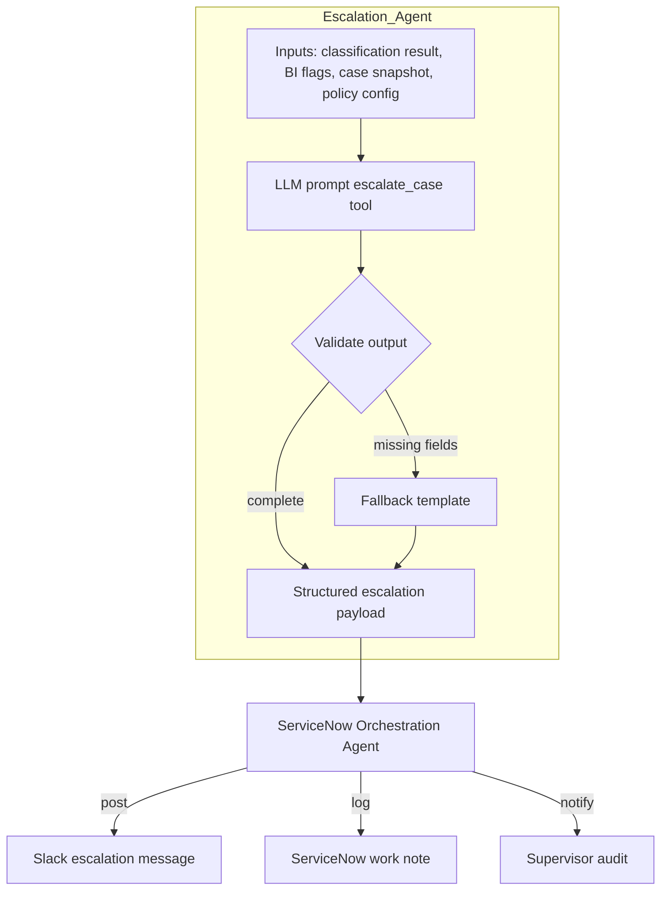
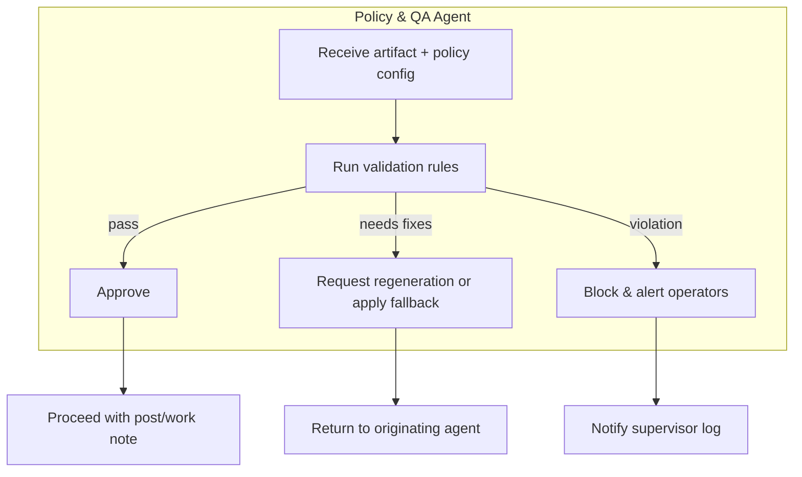
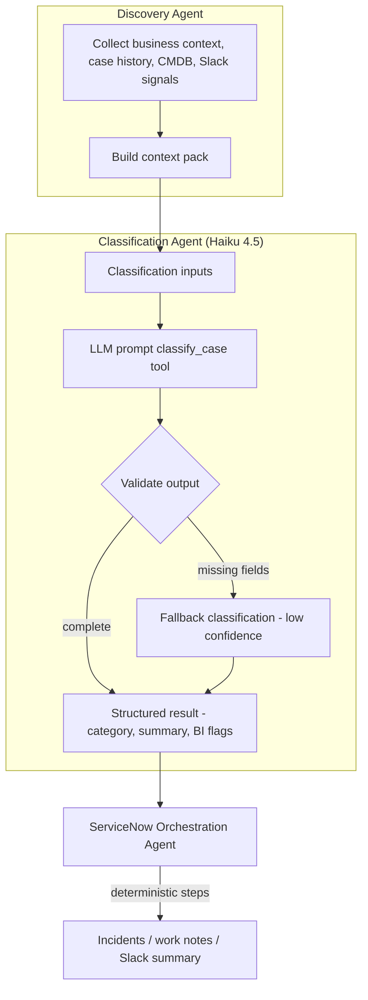
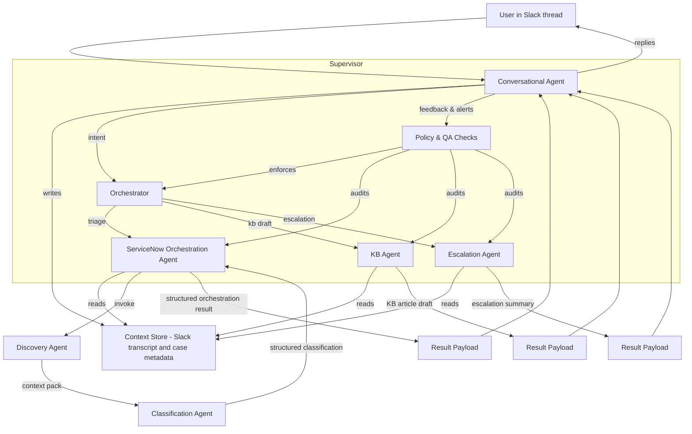

## Agent Architecture Overview

- **Conversational Agent**  
  Maintains the active Slack thread context, writes structured updates to the shared store, and handles everyday guidance. Escalates only when a user explicitly requests automation (e.g., “triage this case”) or when policy rules demand it.

- **Shared Context Store**  
  Existing context manager plus ServiceNow snapshots. Serves as the single source of truth for transcripts, case metadata, and recent journal extracts.

- **Orchestrator**  
  Inspects intent and routes work to the appropriate specialist agent (triage, KB drafting, escalation, etc.), enforcing prerequisites (valid case number, permissions) before dispatch.

- **Specialist Agents**  
  Stateless, single-purpose workers (Discovery, ServiceNow orchestration, KB drafting, escalation messaging today; future workflows later). Each pulls what it needs from the context store, produces structured output, and hands results back for user-facing delivery.
  - **Connectivity Reasoning Agent**  
    Consumes the Discovery `context_pack`, calls approved REST controllers (e.g., Palo Alto Strata Cloud Manager, FortiManager, VeloCloud) for live routing/tunnel status, runs lightweight heuristics to explain connectivity gaps, and returns proposed diagnostics or follow-up questions. Results flow back through the orchestrator to the conversational agent so humans receive actionable next steps. Operates in read-only mode; effectiveness depends on the availability of those controller APIs.

- **Supervisor**  
  Policy/QA layer that governs the orchestrator and specialists. Ensures guardrails (required sections, policy compliance, duplication control), audits results, and raises alerts back to the conversational agent or operators.

## Discovery Agent (Deterministic Context Gathering)

- **Purpose**  
  Compile the richest possible factual context before we invoke any LLM reasoning. Provides upstream grounding for classification, escalation, and future analytics.

- **Inputs**  
  - Case number, sys_id, channel metadata  
  - Business context repository entries (client profile, key contacts, technology stack)  
  - ServiceNow history (recent cases for same client, resolved patterns)  
  - CMDB/CI matches (by name, IP, keywords in journals)  
  - Slack thread excerpts (recent human updates, pinned info)  
  - Policy signals (maintenance windows, SLA breaches, high-risk customers)

- **Responsibilities**  
  - Gather and sanitize data from the above sources deterministically (no LLM).  
  - Summarize each source into compact, structured snippets (e.g., top similar cases with resolution, CI owner group, last three Slack messages).  
  - De-duplicate and prioritize signals (recent over stale, high severity first).  
  - Emit a `context_pack` payload attached to the case/session for downstream agents.  
  - Cache results briefly to avoid hammering APIs if multiple agents need the same info.

- **Outputs**  
  Structured JSON object containing `business_context`, `recent_cases`, `cmdb_hits`, `slack_recent`, `policy_alerts`, and other optional sections. Stored in the context store and passed to the classification agent invocation.

## Classification Sub-Agent (Haiku 4.5)

- **Purpose**  
  Offload model-driven reasoning from the main triage workflow. Takes canonical case metadata and recent journal excerpts, returns structured insights.

- **Inputs**  
  - Case number + sys_id  
  - Short description / full description  
  - Recent journal/activity excerpt (sanitized)  
  - Allowed categories/subcategories (ServiceNow enumerations)  
  - Policy switches (e.g., allow incident recommendation?)

- **Outputs (structured JSON)**  
  - `category`, `subcategory` (matching SN values)  
  - `quick_summary`  
  - `immediate_next_steps` (≤3 bullets)  
  - `urgency_level`, `record_type_suggestion` (incident vs case vs project)  
  - Business-intel flags: systemic issue, project scope, executive/compliance visibility, financial impact notes  
  - Confidence score + reasoning snippets

- **Model**  
  Default to Claude Haiku 4.5 for cost/latency. Allow Sonnet 4.5 fallback when higher reasoning is required (e.g., escalations, QA replays).

- **ServiceNow Orchestration Agent (formerly triage)**  
  - Fetch and validate ServiceNow case data (case + journals).  
  - Call the classification sub-agent (and any future narrative/BI agents), handle fallbacks when required fields are missing.  
  - Run deterministic enrichments: similar-case search, KB lookup, business-rule evaluation (assignment policies, incident/problem thresholds).  
  - Perform ServiceNow side effects: create incidents/problems when authorized, write work notes via `formatWorkNote`, ensure idempotent writes.  
  - Assemble the final Slack/work-note payload using structured pieces from sub-agents plus deterministic references.  
  - Log outcomes and surface policy violations to the supervisor.

- **Responsibilities remaining outside LLMs**
  - ServiceNow fetches (case, journals) + validation  
  - Similar-case & KB searches (deterministic APIs)  
  - Business rule enforcement (assignment groups, incident/problem creation thresholds)  
  - Work-note generation (`formatWorkNote`)  
  - Writing results back to ServiceNow and logging for idempotency  
  - Slack summary formatting and policy checks

- **Optional future splits**  
  If we need even tighter control, we can peel additional micro-agents off the classification stack:
  - *Categorization agent*: choose category/subcategory only, using the ServiceNow taxonomy as reference (Haiku).  
  - *Narrative agent*: craft the quick summary and immediate next steps, potentially with a cheaper model or template-based fallback.  
  - *BI detector*: evaluate systemic/project/compliance flags with extra historical context or Sonnet fallback when higher confidence is required.  
  These remain design options; today they are folded into the single classification sub-agent for simplicity. If we split them later, each micro-agent can be invoked sequentially by the triage agent with deterministic validation between steps.

## Escalation Agent

- **Trigger**  
  Activated by the ServiceNow orchestration agent (or supervisor) when classification output or policy rules indicate `shouldEscalate=true`, high business-intel score, or an explicit user command (e.g., “escalate SCS…”).  
- **Inputs**  
  Structured case snapshot, latest classification payload (summary, BI flags, next steps), recent journal excerpt (sanitized), escalation policy (target channels, on-call roster), reference URLs.  
- **Responsibilities**  
  - Synthesize escalation narrative (issue summary, impact statement, urgency).  
  - Generate recommended actions/next steps tailored for leadership or on-call teams.  
  - Produce Slack Block Kit (or email) payload with severity badges, references, and contact points.  
  - Return structured metadata (e.g., escalation level, notified parties, timestamp) for logging and supervisor audit.  
  - Avoid duplicate escalations (use orchestration agent for idempotency checks).  
- **Outputs**  
  A dual payload: human-facing Block Kit message and structured JSON for logging/ServiceNow work notes.

### Escalation Flow

## Policy & QA Agent (Supervisor)

- **Trigger points**  
  - Prior to posting responses to Slack threads.  
  - Before writing ServiceNow work notes or creating incidents/problems.  
  - Immediately after an escalation payload is generated.  
  - Periodic spot checks or manual audits initiated by operators.
- **Inputs**  
  Structured outputs from the discovery, classification, orchestration, and escalation agents; rendered Slack payloads; work-note HTML; current policy configuration (required sections, escalation limits, allowed channels, idempotency markers).
- **Responsibilities**  
  - Validate required sections and formatting (e.g., Summary, Current State, Context) before messages leave the system.  
  - Enforce business rules (no duplicate escalations, confidence thresholds met, correct channel/recipient routing).  
  - Detect stale or conflicting guidance (e.g., immediate next steps contradict policy) and request regeneration or fallback templates.  
  - Approve, block, or patch outgoing artifacts and log the decision with rationale.  
  - Generate alerts to operators when repeated violations or low-quality outputs occur.
- **Outputs**  
  Approval/denial status with metadata (reason, timestamp, actor), optional corrected payload, and audit records stored alongside case activity.

### Policy & QA Flow

## Classification Flow

## Flow

---

## Architectural Analysis & Future Considerations

This section outlines open questions and areas for further definition identified during a review of the architecture. These points should be considered before implementing new, complex features.

- **Human-in-the-Loop (HITL) & Correction Workflows**  
  _Resolution:_ Flagged artifacts land in `interactive_states` today; we will expose an operator slash command (`/review-latest`) that surfaces pending states (KB approvals, project interviews, supervisor rejections). Operators can approve/reject in-channel, and we will extend the existing admin UI with a review dashboard that reads from `interactive_states` and the new `project_interviews` archive. Supervisor escalations remain immutable until a human explicitly replays or overrides them.

- **Conversational State Management**  
  _Resolution:_ The Interactive State Manager now owns transient workflow progress (e.g., `project_interview` sessions). Each workflow defines a state payload schema, expiry window, and resume handlers. For longer journeys we will compose this with the modal wizard or a lightweight finite-state machine (FSM) helper so every multi-turn flow stores deterministic checkpoints outside the raw transcript.

- **Orchestrator Scalability**  
  _Resolution:_ Introduce a registry-driven router: every specialist agent registers its capability signature (intent keywords, required context, cost/latency hints). The orchestrator consults this registry at runtime rather than a hard-coded map. Agents such as the Project Interview emit completion events (`project_interview.completed`) that the orchestrator can subscribe to for follow-up routing (mentor tasks, analytics). This keeps the orchestrator thin and pluggable.

- **Asynchronous Task User Experience**  
  _Resolution:_ Long-running tasks enqueue background work via `enqueueBackgroundTask` and immediately post/update status blocks through `SlackMessagingService` (using the helper introduced for app mentions). Each async workflow must emit a “working…” message, stream intermediate checkpoints when available, and send a final summary. DM-based interviews already follow this pattern; future flows will reuse the same status-update utility.

- **Configuration Management**  
  _Resolution:_ Move feature configuration into versioned JSON + Zod schemas (see project catalog/interview packs). The `config` module will be extended with a central loader that merges environment configs, database overrides (via `app_settings`), and per-feature JSON data. Feature flags and model selections become declarative entries, enabling safe runtime toggles without redeploying.

## Project Interview Agent

This specialist agent powers the "Project Onboarding & Interview" flow that begins when a user clicks **🚀 I'm Interested** on a project posting.

- **Purpose**  
  Automate the first-contact interview for internal project candidates, gather structured answers, and generate an AI-assisted match report for mentors.

- **Trigger**  
  Fired directly from Slack interactivity (`project_button_interest`) inside `api/interactivity.ts`. The current implementation bypasses the orchestrator for latency reasons, but emits state and telemetry hooks that an orchestrator can subscribe to in a later phase.

- **Inputs**  
  - Project metadata from `lib/projects/catalog.ts` (validated against `data/projects.json`).  
  - Candidate Slack user id / profile provided by the interaction payload.  
  - Interview question pack defined in `lib/projects/interview-session.ts` – either static JSON or dynamically generated via Claude Haiku 4.5 using `lib/projects/question-generator.ts`.  
  - Optional mentor routing info embedded in the project definition.

- **State Management**  
  - Uses `InteractiveStateManager` with the new `project_interview` type backed by the `interactive_states` table.  
  - Stores progress (`currentStep`, collected answers, startedAt) and expires sessions after 12 hours to avoid zombie interviews.  
  - DM channels are the state key so we gracefully resume if the function cold-starts mid-interview.

- **Flow**  
  1. `startInterviewSession` opens a DM via `SlackMessagingService`, posts the first question, and records state.  
  2. If the project opts into dynamic interviews, `question-generator.ts` calls Claude Haiku 4.5 with project background + tech stack to build a tailored question set, which is cached with the session state.  
  3. Incoming DM messages are intercepted in `api/events.ts` before the regular assistant pipeline.  
  4. Each answer updates the persisted payload and streams the next question until complete.  
  5. On completion, answers are evaluated with Anthropic (`scoreInterviewAgainstProject`) to produce a score, summary, and recommended starter tasks. Errors fall back to a manual-review message.

- **Outputs**  
  - Candidate DM recap that includes the provisional match score and any recommended next steps.  
  - Mentor notification (DM) containing the full transcript, scoring summary, and suggested starter work items.  
  - Interactive state marked `completed`, leaving an audit trail for operators or future replay tooling.

- **Future-Ready Hooks**  
  - Wire the emitted `project_interview.completed` event into the orchestrator or workflow router to trigger downstream automation (mentor assignments, dashboards).  
  - Build analytics/reporting on top of the new `project_interviews` table so mentors can review historical matches and success rates.  
  - Maintain per-project question packs and scoring prompts in JSON/Zod configuration to enable project-specific interview tuning without code changes.  
  - Extend mentor notifications to create tasks/issues automatically once orchestration policies are defined.

## Project Stand-Up Agent (Proposed)

- **Purpose**  
  Automate recurring stand-ups/check-ins for active projects, keeping mentors and contributors aligned without manual coordination.

- **Triggers & Cadence**  
  - Scheduled via Vercel cron or Upstash QStash; cadence per project stored in configuration (`project_standup_settings`).  
  - Manual kick-off using `/project-standup run [project-id]` for ad-hoc stand-ups.

- **Inputs**  
  - Project catalog metadata (channel, mentor, interview results)  
  - Accepted roster pulled from `project_interviews` (status = `accepted`) plus optional ServiceNow SPM epics or GitHub project membership  
  - Stand-up configuration (participant roles, cadence, question template, escalation rules)

- **Workflow**  
  1. **Roster Sync:** Resolve active participants (mentors, juniors) via DB lookups and external integrations.  
  2. **Prompt Phase:** DM each participant with a structured check-in (yesterday/today/blockers). Use `InteractiveStateManager` with a new `project_standup` payload type to track responses.  
  3. **Aggregation:** Persist answers in `project_standups` table (project_id, participant, responses, blockers flagged).  
  4. **Summary Delivery:** Post consolidated update to the project channel with open tasks (ServiceNow/GitHub), blockers, and unanswered participants.  
  5. **Escalations:** If blockers persist or participants miss N stand-ups, notify mentors/product owners and enqueue follow-up tasks.

- **State & Persistence**  
  - `project_standups` table (standup_id, project_id, scheduled_at, summary, status)  
  - `project_standup_responses` table (standup_id, participant_id, answers, submitted_at, blocker_flag)  
  - Extend `project_interviews` with roster status to indicate who is actively participating.

- **Future Extensions**  
  - Integrate ServiceNow SPM and GitHub to automatically sync open items, link updates to actual issues, and track time-to-resolution.  
  - Support multi-team cadences and external stakeholders.  
  - Feed stand-up summaries into analytics dashboards for engagement metrics and blocker tracking.
