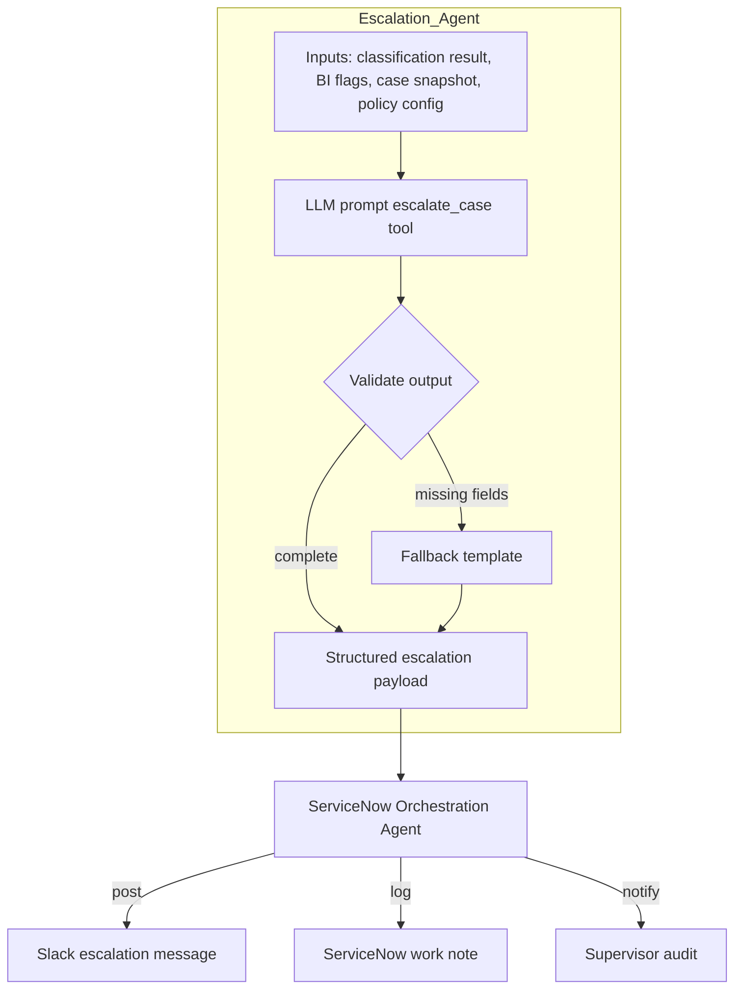
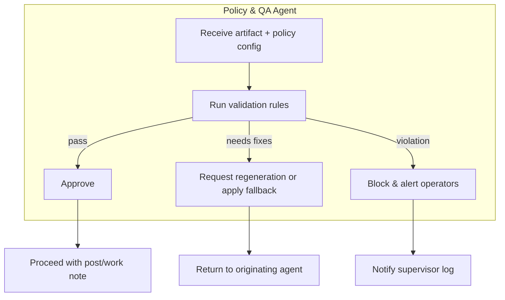
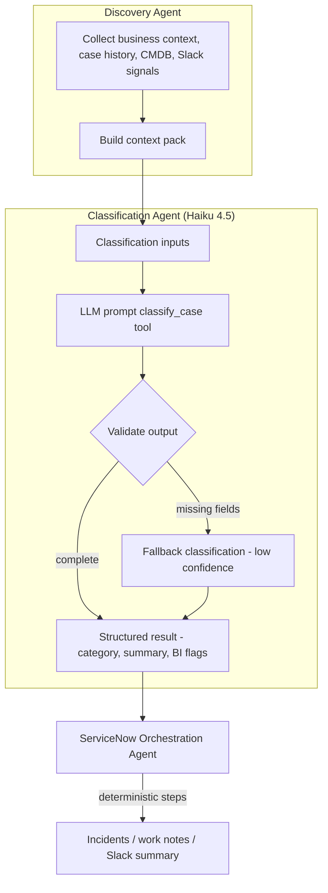
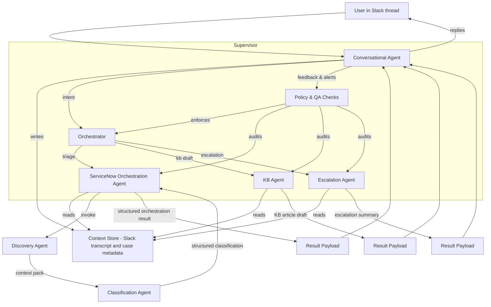

## Agent Architecture Overview

- **Conversational Agent**  
  Maintains the active Slack thread context, writes structured updates to the shared store, and handles everyday guidance. Escalates only when a user explicitly requests automation (e.g., “triage this case”) or when policy rules demand it.

- **Shared Context Store**  
  Existing context manager plus ServiceNow snapshots. Serves as the single source of truth for transcripts, case metadata, and recent journal extracts.

- **Orchestrator**  
  Inspects intent and routes work to the appropriate specialist agent (triage, KB drafting, escalation, etc.), enforcing prerequisites (valid case number, permissions) before dispatch.

- **Specialist Agents**  
  Stateless, single-purpose workers (Discovery, ServiceNow orchestration, KB drafting, escalation messaging today; future workflows later). Each pulls what it needs from the context store, produces structured output, and hands results back for user-facing delivery.

- **Supervisor**  
  Policy/QA layer that governs the orchestrator and specialists. Ensures guardrails (required sections, policy compliance, duplication control), audits results, and raises alerts back to the conversational agent or operators.

## Discovery Agent (Deterministic Context Gathering)

- **Purpose**  
  Compile the richest possible factual context before we invoke any LLM reasoning. Provides upstream grounding for classification, escalation, and future analytics.

- **Inputs**  
  - Case number, sys_id, channel metadata  
  - Business context repository entries (client profile, key contacts, technology stack)  
  - ServiceNow history (recent cases for same client, resolved patterns)  
  - CMDB/CI matches (by name, IP, keywords in journals)  
  - Slack thread excerpts (recent human updates, pinned info)  
  - Policy signals (maintenance windows, SLA breaches, high-risk customers)

- **Responsibilities**  
  - Gather and sanitize data from the above sources deterministically (no LLM).  
  - Summarize each source into compact, structured snippets (e.g., top similar cases with resolution, CI owner group, last three Slack messages).  
  - De-duplicate and prioritize signals (recent over stale, high severity first).  
  - Emit a `context_pack` payload attached to the case/session for downstream agents.  
  - Cache results briefly to avoid hammering APIs if multiple agents need the same info.

- **Outputs**  
  Structured JSON object containing `business_context`, `recent_cases`, `cmdb_hits`, `slack_recent`, `policy_alerts`, and other optional sections. Stored in the context store and passed to the classification agent invocation.

## Classification Sub-Agent (Haiku 4.5)

- **Purpose**  
  Offload model-driven reasoning from the main triage workflow. Takes canonical case metadata and recent journal excerpts, returns structured insights.

- **Inputs**  
  - Case number + sys_id  
  - Short description / full description  
  - Recent journal/activity excerpt (sanitized)  
  - Allowed categories/subcategories (ServiceNow enumerations)  
  - Policy switches (e.g., allow incident recommendation?)

- **Outputs (structured JSON)**  
  - `category`, `subcategory` (matching SN values)  
  - `quick_summary`  
  - `immediate_next_steps` (≤3 bullets)  
  - `urgency_level`, `record_type_suggestion` (incident vs case vs project)  
  - Business-intel flags: systemic issue, project scope, executive/compliance visibility, financial impact notes  
  - Confidence score + reasoning snippets

- **Model**  
  Default to Claude Haiku 4.5 for cost/latency. Allow Sonnet 4.5 fallback when higher reasoning is required (e.g., escalations, QA replays).

- **ServiceNow Orchestration Agent (formerly triage)**  
  - Fetch and validate ServiceNow case data (case + journals).  
  - Call the classification sub-agent (and any future narrative/BI agents), handle fallbacks when required fields are missing.  
  - Run deterministic enrichments: similar-case search, KB lookup, business-rule evaluation (assignment policies, incident/problem thresholds).  
  - Perform ServiceNow side effects: create incidents/problems when authorized, write work notes via `formatWorkNote`, ensure idempotent writes.  
  - Assemble the final Slack/work-note payload using structured pieces from sub-agents plus deterministic references.  
  - Log outcomes and surface policy violations to the supervisor.

- **Responsibilities remaining outside LLMs**
  - ServiceNow fetches (case, journals) + validation  
  - Similar-case & KB searches (deterministic APIs)  
  - Business rule enforcement (assignment groups, incident/problem creation thresholds)  
  - Work-note generation (`formatWorkNote`)  
  - Writing results back to ServiceNow and logging for idempotency  
  - Slack summary formatting and policy checks

- **Optional future splits**  
  If we need even tighter control, we can peel additional micro-agents off the classification stack:
  - *Categorization agent*: choose category/subcategory only, using the ServiceNow taxonomy as reference (Haiku).  
  - *Narrative agent*: craft the quick summary and immediate next steps, potentially with a cheaper model or template-based fallback.  
  - *BI detector*: evaluate systemic/project/compliance flags with extra historical context or Sonnet fallback when higher confidence is required.  
  These remain design options; today they are folded into the single classification sub-agent for simplicity. If we split them later, each micro-agent can be invoked sequentially by the triage agent with deterministic validation between steps.

## Escalation Agent

- **Trigger**  
  Activated by the ServiceNow orchestration agent (or supervisor) when classification output or policy rules indicate `shouldEscalate=true`, high business-intel score, or an explicit user command (e.g., “escalate SCS…”).  
- **Inputs**  
  Structured case snapshot, latest classification payload (summary, BI flags, next steps), recent journal excerpt (sanitized), escalation policy (target channels, on-call roster), reference URLs.  
- **Responsibilities**  
  - Synthesize escalation narrative (issue summary, impact statement, urgency).  
  - Generate recommended actions/next steps tailored for leadership or on-call teams.  
  - Produce Slack Block Kit (or email) payload with severity badges, references, and contact points.  
  - Return structured metadata (e.g., escalation level, notified parties, timestamp) for logging and supervisor audit.  
  - Avoid duplicate escalations (use orchestration agent for idempotency checks).  
- **Outputs**  
  A dual payload: human-facing Block Kit message and structured JSON for logging/ServiceNow work notes.

### Escalation Flow

## Policy & QA Agent (Supervisor)

- **Trigger points**  
  - Prior to posting responses to Slack threads.  
  - Before writing ServiceNow work notes or creating incidents/problems.  
  - Immediately after an escalation payload is generated.  
  - Periodic spot checks or manual audits initiated by operators.
- **Inputs**  
  Structured outputs from the discovery, classification, orchestration, and escalation agents; rendered Slack payloads; work-note HTML; current policy configuration (required sections, escalation limits, allowed channels, idempotency markers).
- **Responsibilities**  
  - Validate required sections and formatting (e.g., Summary, Current State, Context) before messages leave the system.  
  - Enforce business rules (no duplicate escalations, confidence thresholds met, correct channel/recipient routing).  
  - Detect stale or conflicting guidance (e.g., immediate next steps contradict policy) and request regeneration or fallback templates.  
  - Approve, block, or patch outgoing artifacts and log the decision with rationale.  
  - Generate alerts to operators when repeated violations or low-quality outputs occur.
- **Outputs**  
  Approval/denial status with metadata (reason, timestamp, actor), optional corrected payload, and audit records stored alongside case activity.

### Policy & QA Flow

## Classification Flow

## Flow

