# Incident Enrichment System - Complete Flow Diagram

## Overview

The Incident Enrichment System automatically analyzes incidents, extracts technical entities, matches them to Configuration Items (CIs), and enriches incidents with relevant metadata. The system runs continuously via a cron job and processes incidents through multiple stages with human-in-the-loop workflows for ambiguous cases.

## Complete End-to-End Flow

```mermaid
flowchart TD
    Start([Incident Created from Case]) --> Insert[Insert into Watchlist<br/>incident_enrichment_states<br/>stage: 'created']
    Insert --> WaitCron{Cron Job<br/>Every 15 min}

    WaitCron --> FetchList[Get Active Incidents<br/>stages: created, notes_analyzed, ci_matched<br/>not processed in last 15 min]

    FetchList --> CheckFeature{Feature Flag<br/>ENABLE_INCIDENT_ENRICHMENT?}
    CheckFeature -->|false| Skip[Skip - Feature Disabled]
    CheckFeature -->|true| FetchIncident[Fetch Incident from ServiceNow<br/>getIncident]

    FetchIncident --> IncidentExists{Incident<br/>Found?}
    IncidentExists -->|No| MarkError[Mark Stage: 'error'<br/>Prevent Retry Loop]
    IncidentExists -->|Yes| FetchNotes[Fetch Work Notes<br/>getIncidentWorkNotes<br/>limit: 20]

    FetchNotes --> LLM[LLM Analysis<br/>Claude Sonnet 4.5<br/>Extract Entities]

    LLM --> Extract{Entities<br/>Extracted?}
    Extract -->|Yes| SaveEntities[Save to DB<br/>extracted_entities<br/>stage: 'notes_analyzed']
    Extract -->|No| Fallback[Regex Fallback<br/>Extract ACCT, IPs]
    Fallback --> SaveEntities

    SaveEntities --> Match[CI Matching Service<br/>matchEntities]

    Match --> CheckInventory[Check VeloCloud Inventory<br/>ci-records/velocloud-edges.json]
    CheckInventory --> MatchEdges{Match by<br/>Edge Name?}
    MatchEdges -->|Exact| Add100[Add Match<br/>Confidence: 100%]
    MatchEdges -->|Partial| Add85[Add Match<br/>Confidence: 85%]
    MatchEdges -->|No| CheckAccount

    CheckAccount{Match by<br/>Account?} -->|Yes Active| Add90[Add Match<br/>Confidence: 90%]
    CheckAccount -->|Yes Inactive| Add75[Add Match<br/>Confidence: 75%]
    CheckAccount -->|No| CheckCMDB

    CheckCMDB[Query ServiceNow CMDB<br/>getCmdbRepository] --> MatchIP{Match by<br/>IP Address?}
    MatchIP -->|Yes| Add95IP[Add Match<br/>Confidence: 95%]
    MatchIP -->|No| MatchHost

    MatchHost{Match by<br/>Hostname?} -->|Yes| Add95Host[Add Match<br/>Confidence: 95%]
    MatchHost -->|No| MatchName

    MatchName{Match by<br/>Name?} -->|Yes| Add85Name[Add Match<br/>Confidence: 85%]
    MatchName -->|No| Dedupe

    Add100 --> Dedupe[Deduplicate Matches<br/>Keep Highest Confidence]
    Add85 --> Dedupe
    Add90 --> Dedupe
    Add75 --> Dedupe
    Add95IP --> Dedupe
    Add95Host --> Dedupe
    Add85Name --> Dedupe

    Dedupe --> Sort[Sort by Confidence<br/>Highest First]
    Sort --> Split{Confidence<br/>Threshold?}

    Split -->|≥70%| HighConf[High Confidence Matches]
    Split -->|<70%| LowConf[Low Confidence Matches]

    HighConf --> HasHigh{Has High<br/>Confidence?}
    HasHigh -->|Yes| AutoLink[Auto-Link CI<br/>linkCiToIncident<br/>Top Match]
    HasHigh -->|No| CheckLow

    AutoLink --> AddNote[Add Work Note<br/>Enrichment Summary<br/>+ Matched CI Details]
    AddNote --> UpdateCase[Update Parent Case<br/>addCaseWorkNote<br/>CI Linked Notification]
    UpdateCase --> SaveCIs[Save Matched CIs to DB<br/>matched_cis<br/>confidence_scores]
    SaveCIs --> MarkEnriched[Mark Stage: 'enriched']

    CheckLow{Has Low<br/>Confidence?} -->|Yes| SendSlack[Send Slack Clarification<br/>requestClarification]
    CheckLow -->|No| NoMatches

    SendSlack --> ValidateChannel{Slack Channel<br/>Configured?}
    ValidateChannel -->|No| FailFast[Fail Fast<br/>Error: No channel configured]
    ValidateChannel -->|Yes| PostBlocks[Post Block Kit Message<br/>with CI Options as Buttons]

    PostBlocks --> SavePending[Save in Pending Cache<br/>clarification_slack_ts<br/>stage: 'clarification_pending']
    SavePending --> WaitButton{Wait for<br/>Button Click}

    WaitButton -->|24hrs TTL| Expire[Clarification Expired<br/>Retry Enrichment]
    WaitButton -->|Button Clicked| HandleButton[api/interactivity.ts<br/>handleIncidentEnrichmentAction]

    HandleButton --> ParsePayload{Parse Button<br/>Payload}
    ParsePayload -->|select_ci_*| SelectCI[Extract:<br/>incident_sys_id<br/>ci_sys_id<br/>ci_name]
    ParsePayload -->|skip_ci| SkipCI[handleSkipAction<br/>Mark 'enriched'<br/>manual_skip: true]

    SelectCI --> CallService[handleClarificationResponse<br/>Link Selected CI]
    CallService --> LinkManual[linkCiToIncident<br/>Add Work Note:<br/>'Manual Selection via Slack']
    LinkManual --> UpdateSlack[Update Slack Message<br/>'✓ CI linked by @user']
    UpdateSlack --> MarkEnriched

    SkipCI --> UpdateSlackSkip[Update Slack Message<br/>'✓ Skipped - Manual CI needed']
    UpdateSlackSkip --> MarkEnriched

    NoMatches[No Matches Found] --> AddNoMatch[Add Work Note<br/>'No CI matches found']
    AddNoMatch --> MarkEnriched

    MarkEnriched --> WaitClose{Incident<br/>Lifecycle}
    MarkError --> WaitClose
    Skip --> WaitClose
    FailFast --> WaitClose
    Expire --> WaitCron

    WaitClose -->|State: Resolved| FinalEnrich[Webhook Trigger<br/>handleIncidentUpdate<br/>Run Final Enrichment]
    FinalEnrich --> CheckClosed

    WaitClose -->|State: Closed| CheckClosed{State = 7<br/>Closed?}
    CheckClosed -->|Yes| Remove[Remove from Watchlist<br/>removeFromWatchlist]
    CheckClosed -->|No| WaitCron

    Remove --> End([Complete])

    WaitCron[Wait for Next Cron Run] --> WaitCron

    style Start fill:#e1f5e1
    style End fill:#ffe1e1
    style LLM fill:#e1e5ff
    style AutoLink fill:#c8e6c9
    style SendSlack fill:#fff3cd
    style HandleButton fill:#d1ecf1
    style Remove fill:#f8d7da
    style MarkError fill:#f8d7da
    style FailFast fill:#f8d7da
```



## Workflow Stages

### Stage 1: Watchlist Insertion
**Trigger:** Incident created from case
**File:** `lib/services/case-triage/incident-handler.ts:191-223`
**Action:**
- Insert incident into `incident_enrichment_states` table
- Set stage: `created`
- Store case context (Slack channel, thread, account)

### Stage 2: Entity Extraction
**Trigger:** Cron job (every 15 minutes)
**File:** `api/cron/enrich-pending-incidents.ts`
**Process:**
1. Query watchlist for incidents in `created`, `notes_analyzed`, or `ci_matched` stages
2. Filter: not processed in last 15 minutes
3. Batch limit: 50 incidents per run

**Service:** `IncidentNoteAnalyzerService`
**File:** `lib/services/incident-note-analyzer.ts:40-156`
**Action:**
- Fetch incident work notes (up to 20)
- Combine short description + work notes
- Send to Claude Sonnet 4.5 for entity extraction
- Extract:
  - **IP Addresses** (IPv4/IPv6)
  - **Hostnames** (FQDNs, server names)
  - **Edge Names** (VeloCloud edges, routers, switches)
  - **Error Messages** (error codes, stack traces)
  - **System Names** (servers, services, applications)
  - **Account Numbers** (ACCT + 7 digits, e.g., ACCT0242146)
- Fallback to regex if LLM fails
- Save entities to DB
- Update stage: `notes_analyzed`

### Stage 3: CI Matching
**Service:** `CIMatchingService`
**File:** `lib/services/ci-matching-service.ts:306-369`

#### 3A: VeloCloud Inventory Matching
**Data Source:** `ci-records/velocloud-edges.json` (29 TPX edges)
**Matching Logic:**
- **Exact edge name match** → 100% confidence
- **Partial edge name match** → 85% confidence
- **Account number match (active edge)** → 90% confidence
- **Account number match (inactive edge)** → 75% confidence
- **Site name match** → 80% confidence

#### 3B: ServiceNow CMDB Matching
**Data Source:** ServiceNow CMDB via `getCmdbRepository()`
**Matching Logic:**
- **IP address match** → 95% confidence
- **Hostname/FQDN match** → 95% confidence
- **Name search match** → 85% confidence

#### 3C: Deduplication & Scoring
- Deduplicate by `sys_id` (keep highest confidence)
- Sort by confidence (descending)
- Separate into:
  - **High confidence:** ≥70% (configurable via `INCIDENT_ENRICHMENT_CONFIDENCE_THRESHOLD`)
  - **Low confidence:** <70%

### Stage 4A: Auto-Link (High Confidence ≥70%)
**File:** `lib/services/incident-enrichment-service.ts:117-171`
**Action:**
1. Select top match (highest confidence)
2. Link CI to incident via `linkCiToIncident(incident_sys_id, ci_sys_id)`
3. Add work note to incident with:
   - Enrichment summary (extracted entities)
   - Matched CI details (name, class, confidence, source, reason)
4. Update parent case with notification
5. Save matched CIs and confidence scores to DB
6. Update stage: `enriched`

**Example Work Note:**
```
## Automated Incident Enrichment

The following technical entities were identified:

**Account Numbers:** ACCT0242146
**Edge/Network Devices:** ACCT0242146 - Amarillo North - 2101 S Coulter St, Amarillo
**IP Addresses:** 192.168.1.100

---

**Matched Configuration Item:**
- **Name:** ACCT0242146 - Amarillo North - 2101 S Coulter St
- **Class:** VeloCloud Edge
- **Confidence:** 100%
- **Source:** inventory
- **Reason:** Exact edge name match

---
*This enrichment was generated automatically by the AI-powered incident analysis system.*
```

### Stage 4B: Slack Clarification (Low Confidence <70%)
**File:** `lib/services/incident-clarification-service.ts:36-199`
**Action:**
1. Validate Slack channel configured (fail fast if not)
2. Build Block Kit message with:
   - Header: "🔍 CI Clarification Needed: INC0012345"
   - Up to 5 CI options as buttons with:
     - CI name, class, confidence, match reason
     - "Select This CI" button with JSON payload
   - "Skip Auto-Link" button
3. Post to Slack channel (or thread if available)
4. Store in pending cache (4hr TTL)
5. Update stage: `clarification_pending`

**Example Slack Message:**
```
🔍 CI Clarification Needed: INC0012345

Multiple possible Configuration Items were found, but none with high enough confidence to auto-link.

Please select the correct CI for this incident:

───────

Option 1: Edge-Dallas-Primary
Class: VeloCloud Edge
Confidence: 65%
Match Reason: Partial edge name match
[Select This CI]

Option 2: Edge-Dallas-Backup
Class: VeloCloud Edge
Confidence: 60%
Match Reason: Account number match (ACCT0242146) - Active
[Select This CI]

───────

None of the above match?
You can manually link the CI in ServiceNow.
[Skip Auto-Link]
```

### Stage 5: Button Response Handling
**File:** `api/interactivity.ts:774-877`
**Trigger:** Technician clicks button in Slack
**Process:**

#### 5A: Select CI Button
1. Parse button payload:
   ```json
   {
     "action": "select_ci",
     "incident_sys_id": "abc123",
     "ci_sys_id": "xyz789",
     "ci_name": "Edge-Dallas-Primary"
   }
   ```
2. Call `handleClarificationResponse()`
3. Link selected CI via `linkCiToIncident()`
4. Add work note: "Manual CI Selection (via Slack)"
5. Update Slack message: "✓ CI linked by @user: Edge-Dallas-Primary"
6. Update stage: `enriched`

#### 5B: Skip Button
1. Parse button payload
2. Call `handleSkipAction()`
3. Update Slack message: "✓ CI linking skipped - Manual linking needed"
4. Update stage: `enriched` with metadata `manual_skip: true`

### Stage 6: No Matches Found
**File:** `lib/services/incident-enrichment-service.ts:228-248`
**Action:**
1. Add work note: "No matching Configuration Items found"
2. Suggest manual CI linking
3. Update stage: `enriched`

### Stage 7: Incident Lifecycle
**File:** `lib/services/incident-sync-service.ts:67-113`

#### 7A: Resolved State (State 6)
- Webhook triggered
- Run final enrichment pass (catches any new work notes)
- Sync resolution to parent case

#### 7B: Closed State (State 7)
- Webhook triggered
- Run final enrichment pass
- Remove from watchlist via `removeFromWatchlist()`
- Sync closure to parent case

### Stage 8: Error Handling

#### Error Scenario 1: Incident Not Found
**Trigger:** `getIncident()` returns null
**Action:**
- Mark stage: `error`
- Store metadata: `{ error: "incident_not_found", error_at: timestamp }`
- Prevents infinite retry loop
- Cron job skips `error` stage

#### Error Scenario 2: Slack Channel Not Configured
**Trigger:** No `channelId` and no `SLACK_DEFAULT_CHANNEL`
**Action:**
- Return error immediately (fail fast)
- Do NOT call Slack API with invalid channel
- Log error for alerting

#### Error Scenario 3: Clarification Timeout
**Trigger:** 24 hours since clarification requested
**Action:**
- Cron job retries enrichment
- May result in new clarification or different match

## Confidence Scoring Matrix

| Match Type | Confidence | Source | Auto-Link? |
|------------|-----------|---------|------------|
| Exact edge name | 100% | VeloCloud Inventory | ✅ Yes |
| IP address | 95% | ServiceNow CMDB | ✅ Yes |
| Hostname/FQDN | 95% | ServiceNow CMDB | ✅ Yes |
| Account (active edge) | 90% | VeloCloud Inventory | ✅ Yes |
| Partial edge name | 85% | VeloCloud Inventory | ✅ Yes |
| CMDB name match | 85% | ServiceNow CMDB | ✅ Yes |
| Site name | 80% | VeloCloud Inventory | ✅ Yes |
| Account (inactive edge) | 75% | VeloCloud Inventory | ✅ Yes |
| Ambiguous match | <70% | Any | ❌ Requires clarification |

## Database Schema

**Table:** `incident_enrichment_states`

```sql
CREATE TABLE "incident_enrichment_states" (
  "id" uuid PRIMARY KEY DEFAULT gen_random_uuid() NOT NULL,
  "incident_sys_id" text NOT NULL,
  "incident_number" text NOT NULL,
  "case_sys_id" text,
  "case_number" text,
  "enrichment_stage" text DEFAULT 'created' NOT NULL,
  "matched_cis" jsonb DEFAULT '[]'::jsonb NOT NULL,
  "extracted_entities" jsonb DEFAULT '{}'::jsonb NOT NULL,
  "confidence_scores" jsonb DEFAULT '{}'::jsonb NOT NULL,
  "clarification_requested_at" timestamp with time zone,
  "clarification_slack_ts" text,
  "last_processed_at" timestamp with time zone DEFAULT now() NOT NULL,
  "created_at" timestamp with time zone DEFAULT now() NOT NULL,
  "updated_at" timestamp with time zone DEFAULT now() NOT NULL,
  "metadata" jsonb DEFAULT '{}'::jsonb NOT NULL
);
```

**Enrichment Stages:**
- `created` - Incident added to watchlist
- `notes_analyzed` - Work notes analyzed, entities extracted
- `ci_matched` - CIs matched, confidence scored
- `clarification_pending` - Awaiting Slack response (confidence <70%)
- `enriched` - CI linked and incident updated
- `error` - Fatal error occurred, skip retries
- `completed` - Final enrichment complete (deprecated, use removal)

## Configuration

**Environment Variables:**

```bash
# Feature toggle (default: false for safety)
ENABLE_INCIDENT_ENRICHMENT=false

# Confidence threshold (0-100, default: 70)
INCIDENT_ENRICHMENT_CONFIDENCE_THRESHOLD=70

# Cron batch size (default: 50)
INCIDENT_ENRICHMENT_CRON_BATCH_SIZE=50

# Cron interval in minutes (default: 15)
INCIDENT_ENRICHMENT_CRON_INTERVAL=15

# Slack channel for clarifications (required if channelId not in metadata)
SLACK_DEFAULT_CHANNEL=C07B7JZJZ

# LLM model (default: claude-sonnet-4-5)
ANTHROPIC_MODEL=claude-sonnet-4-5
```

## File Structure

### New Files Created
```
migrations/0017_wealthy_lake.sql                          # Database migration
lib/db/repositories/incident-enrichment-repository.ts    # Repository layer (442 lines)
lib/services/ci-matching-service.ts                      # CI matching logic (399 lines)
lib/services/incident-note-analyzer.ts                   # LLM entity extraction (238 lines)
lib/services/incident-enrichment-service.ts              # Main orchestrator (388 lines)
lib/services/incident-clarification-service.ts           # Slack interactions (343 lines)
api/cron/enrich-pending-incidents.ts                     # Cron job (211 lines)
```

### Modified Files
```
lib/db/schema.ts                                         # Added table definition
lib/tools/servicenow.ts                                  # Added 3 new methods
api/interactivity.ts                                     # Added button handler
lib/services/incident-sync-service.ts                    # Final enrichment + cleanup
lib/services/case-triage/incident-handler.ts            # Watchlist insertion
.env.example                                              # Environment variables
vercel.json                                               # Cron schedule
```

## Key Features

### 1. Intelligent Entity Extraction
- Uses Claude Sonnet 4.5 to understand context
- Extracts 6 types of technical entities
- Handles variations and abbreviations
- Regex fallback for robustness

### 2. Multi-Source CI Matching
- **VeloCloud Inventory:** Local JSON file with 29 edges
- **ServiceNow CMDB:** Live API queries for all CI classes
- Confidence scoring based on match type
- Deduplication keeps best match

### 3. Human-in-the-Loop
- Low confidence matches trigger Slack clarification
- Interactive buttons for technician selection
- Prevents incorrect auto-linking
- TTL prevents stale requests

### 4. Error Resilience
- Fail-fast on misconfiguration
- Error stages prevent retry loops
- Graceful fallbacks (LLM → regex)
- Comprehensive logging

### 5. Lifecycle Management
- Automatic watchlist insertion
- Continuous processing via cron
- Final enrichment before closure
- Automatic cleanup when closed

## Operational Notes

### Monitoring
- Check watchlist size: `SELECT COUNT(*) FROM incident_enrichment_states`
- Check stuck incidents: `SELECT * FROM incident_enrichment_states WHERE enrichment_stage = 'clarification_pending' AND clarification_requested_at < NOW() - INTERVAL '24 hours'`
- Check errors: `SELECT * FROM incident_enrichment_states WHERE enrichment_stage = 'error'`

### Debugging
- Enable via: `ENABLE_INCIDENT_ENRICHMENT=true`
- Logs prefix: `[Incident Enrichment Service]`, `[CI Matching Service]`, `[Incident Note Analyzer]`
- Check cron execution: `/api/cron/enrich-pending-incidents` (GET/POST)

### Performance
- LLM calls: ~500-1000 tokens per incident (input + output)
- CMDB queries: Cached when possible
- VeloCloud inventory: Loaded once on initialization
- Batch processing: 50 incidents per cron run (configurable)

## Deployment Checklist

- [ ] Run database migration: `pnpm db:migrate`
- [ ] Set `ENABLE_INCIDENT_ENRICHMENT=true`
- [ ] Configure `SLACK_DEFAULT_CHANNEL` (or ensure Slack context in cases)
- [ ] Verify VeloCloud inventory exists: `ci-records/velocloud-edges.json`
- [ ] Test with one incident manually
- [ ] Monitor watchlist growth
- [ ] Verify cron job execution in Vercel logs

## Architecture Principles

1. **Fail-Fast:** Misconfigurations return errors immediately
2. **Idempotent:** Re-running enrichment is safe
3. **Observable:** Comprehensive logging at each stage
4. **Configurable:** Feature flags and thresholds
5. **Resilient:** Error handling prevents cascading failures
6. **Asynchronous:** Non-blocking with cron-based processing
7. **Human-Aware:** Low confidence triggers human review

---

**Last Updated:** 2025-11-01
**Version:** 1.0
**Status:** Production Ready
