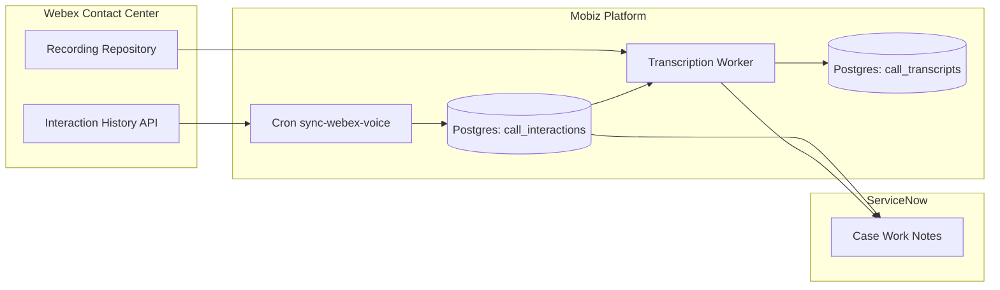

# Webex Contact Center Voice Integration Plan

**Status:** Design complete (implementation in progress)

This document captures the planned integration for synchronizing Webex Contact Center voice interactions into the Mobiz observability stack and ServiceNow. Use it as a blueprint when we revisit the effort.

---

## Objectives

1. **Persist call metadata** for all voice interactions (inbound/outbound) associated with ServiceNow cases.
2. **Surface call history automatically** in work notes or dashboards so analysts can see when a customer called.
3. **Enable transcript/recording ingestion** so future AI workflows can summarize or analyze voice conversations.

---

## Data Flow Overview

---

## Database Structures

### `call_interactions`
Stores one row per Webex Contact Center voice session.

| Column | Type | Notes |
| --- | --- | --- |
| `session_id` | text (PK) | Webex session/contact identifier |
| `case_number` | text | Mapped from Webex attributes (if available) |
| `direction` | text | inbound/outbound |
| `ani` / `dnis` | text | Caller/called numbers |
| `agent_id` / `agent_name` | text | Assigned agent at call end |
| `queue_name` | text | Queue/skill group |
| `start_time` / `end_time` | timestamptz | Call timestamps |
| `duration_seconds` | int | Derived from start/end |
| `wrap_up_code` | text | Agent disposition |
| `recording_id` | text | Webex recording reference |
| `transcript_status` | text | pending / processing / complete / error |
| `raw_payload` | jsonb | Original Webex interaction payload |
| `synced_at` | timestamptz | Last sync time |

### `call_transcripts`
Tracks audio download + transcription pipeline.

| Column | Type | Notes |
| --- | --- | --- |
| `id` | uuid (PK) | Internal identifier |
| `session_id` | text FK → call_interactions | |
| `provider` | text | e.g., `webex`, `whisper` |
| `status` | text | pending / downloading / transcribing / complete / error |
| `language` | text | Detected/declared language |
| `transcript_text` | text | Full transcription |
| `transcript_json` | jsonb | Optional word-level detail |
| `audio_url` | text | Storage location for audio asset |
| `error_message` | text | Last error encountered |

---

## Required Environment Variables

Add to Vercel (staging/production as needed):

| Variable | Description | Source |
| --- | --- | --- |
| `WEBEX_CC_CLIENT_ID` | OAuth client ID | Webex developer portal integration |
| `WEBEX_CC_CLIENT_SECRET` | OAuth client secret | Same integration |
| `WEBEX_CC_REFRESH_TOKEN` | Refresh token for long-lived access | Obtain via OAuth code flow |
| `WEBEX_CC_ACCESS_TOKEN` | (Optional override) direct token | Use only for manual testing |
| `WEBEX_CC_ORG_ID` | Webex organization ID | Control Hub → Organization Settings |
| `WEBEX_CC_BASE_URL` | API base (default `https://webexapis.com/v1`) | Optional |
| `WEBEX_CC_INTERACTION_PATH` | Default `contactCenter/interactionHistory` | Optional |
| `CALL_SYNC_LOOKBACK_MINUTES` | How far back the first sync looks (default 15) | Optional |
| `WORKNOTE_LOOKBACK_MINUTES` | Fallback window for ServiceNow work note cron (default 60) | Optional |
| `CALL_RECORDING_BUCKET` | S3 bucket for audio (future) | Optional |
| `TRANSCRIPTION_PROVIDER` | `webex` or `whisper` (future) | Optional |
| `TRANSCRIPTION_MODEL` | e.g., `whisper-1` (future) | Optional |

---

## OAuth Setup (Webex Contact Center)

1. **Verify API entitlement**: ensure Webex Contact Center tenant has API access enabled (Control Hub → Contact Center).
2. **Create a Webex Integration** at https://developer.webex.com → My Apps → Create Integration. Scopes typically required:
   - `cjp:contact:read`
   - `analytics_contact_center_read`
   - `spark:all` (if transcripts/recordings use general Webex APIs)
3. **Run OAuth code flow** to obtain refresh token:
   - Authorization URL: `https://webexapis.com/v1/authorize?response_type=code&client_id=...`
   - Exchange code for tokens at `https://webexapis.com/v1/access_token`
4. Store the refresh token securely; it will be used by the cron job to mint access tokens on demand.

Alternative: If Cisco provides service account credentials inside the Contact Center Admin Portal (Users → Service Accounts), those can supply client ID/secret without the custom integration.

---

## Scheduled Jobs

- `GET /api/cron/sync-webex-voice` (every 10 minutes recommended)
  - Loads last sync timestamp from `app_settings`
  - Calls Webex Interaction History API
  - Upserts rows into `call_interactions`
  - Updates checkpoint to newest `end_time`
  - Optionally posts ServiceNow work notes (future enhancement)
- `GET /api/cron/sync-voice-worknotes` (temporary backfill job)
  - Parses legacy ServiceNow work notes containing call metadata (pattern: “Call from … Session ID …”)
  - Inserts rows into `call_interactions` so historical sessions are tracked even before Webex API ingestion
  - Uses `sn:last_voice_worknote_sync_at` app setting to avoid reprocessing

- `GET /api/cron/close-resolved-incidents` (existing job)
  - Unrelated to voice, but part of the same scheduled maintenance suite

**Future jobs (planned, not implemented):**
- `process-webex-recordings` → download audio when `recording_id` present
- `transcribe-webex-recordings` → send audio to transcription provider and update `call_transcripts`

---

## ServiceNow Integration Points

1. **Work notes**: When a call is stored, post a structured note (caller number, direction, duration, agent, link to details) unless one already exists.
2. **Incident related list**: Build a small UI action or REST data source that queries `call_interactions` by case number so analysts can view call history without leaving ServiceNow.
3. **Transcripts** (future): Once transcription pipeline is live, attach the summarized transcript to the incident or store it in the knowledge base.

---

## Outstanding Tasks (Future Phases)

- Add background worker to fetch recordings (`call_interactions.recording_id`) and store audio in S3.
- Integrate with transcription service (Webex Speech Analytics or external ASR like OpenAI Whisper).
- Build Slack `/case calls` command to display call history from the new tables.
- Design retention policy (e.g., delete audio after 30 days, keep metadata 1 year).
- Monitoring/alerting for cron job failures (Vercel log drain or Grafana alerts).

---

## References

- Cisco Webex Contact Center API docs: https://developer.webex.com/docs/contact-center
- OAuth guide: https://developer.webex.com/docs/integrations
- Internal schema: `lib/db/schema.ts` tables `call_interactions`, `call_transcripts`
- Cron handler: `api/cron/sync-webex-voice.ts`
- Repository helpers: `lib/db/repositories/call-interaction-repository.ts`

---

Update this document as you implement subsequent phases (recordings, transcripts, UI surfacing). For now it serves as the canonical design reference.
